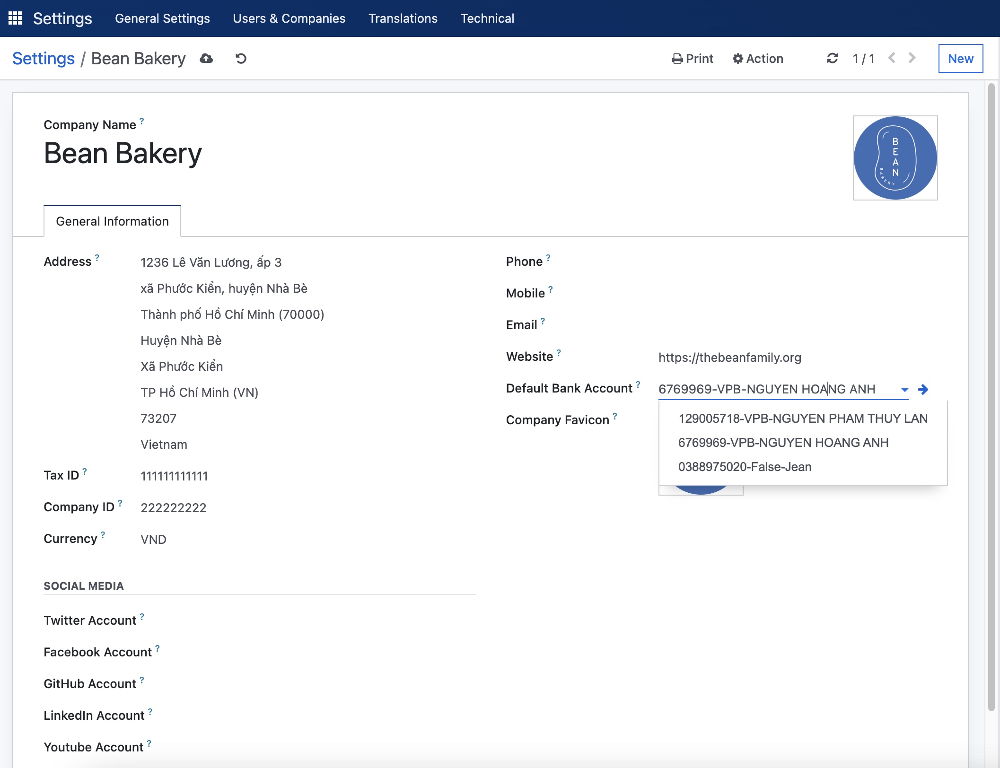

# Vietnamese Bank List Module

This module add the list of Vietnamese banks information to Odoo (The bank list is updated by the State Bank of
Vietnam including bank name, bank code, bank bic ...) and add the default bank account for the company. 
This module is the base module for generator VietQR module. VietQR is the Vietnam's QR standard for
payment.

This module is the base module for generator VietQR module. VietQR is the Vietnam's QR standard for bank payment.

To set the default account for the company, please go to Setting/General Settings/Companies tab and click on the
"Update Info" link. The company info screen will show as following:

Authors & Maintainers
-------------------------
- The Bean Family
- Email: community@thebeanfamily.org